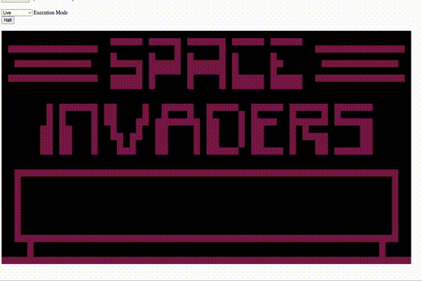
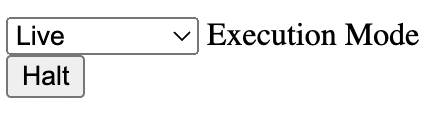
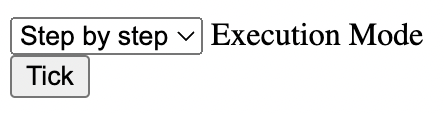
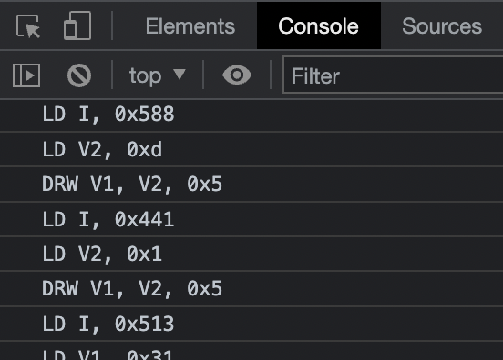

# Tostiloco

_Another_ chip8 emulator in Rust. Currently compiles to WebAssembly.

Graphics are rendered with webGL and eventually perhaps a desktop
opengl or metal version if I don't get bored. 
(UPDATE: I'm working on an NES emulator so will not continue to update this)

## Requirements

### Build requirements
* Rust ([Installing Rust](https://www.rust-lang.org/tools/install))
* Wasm-pack ([Installing wasm-pack](https://rustwasm.github.io/wasm-pack/installer/))
### Run requirements
* Chromium-based browser or firefox, Safari WebGL2 support is unfortunately spotty so won't work here
* Python3 (optional), only needed to run a default web server. You can otherwise use `node` or anything else to run a
webserver. You need a webserver as modern browsers will CORS block `fetch` to pull a wasm module if using
`file://`.

## Running

Run `make` to generate the .wasm file, then `make run` to service index.html over http://localhost:8000 (or any other webserver you want)

### Controls

CHIP8 had the keys 0-9 and A-F. I mapped everything to their original keys for simplicity. Works fine for the numbered
keys but awkward for the letters but I found most games use the numbers anyways. 

### Supported roms

Emulator supports any chip8 (but not superchip8) roms. Usually end in a `.ch8` extension. The file format is as 
basic as it gets. No headers or anything just a raw stream of bytes representing the instructions.

### Modes

The emulator runs in two modes, `Live` and `Step by step`.

Live mode is straightforward and just runs in a loop executing instructions at a clock speed of about 400 'ticks' per 
second.

The `Halt` button is what will finally break out of the execution loop. chip8 doesnt have a HALT instruction (although superchip8 has one with `EXIT`)

In step by step mode you'll need to click `Tick` to execute each instruction:

Each instruction will go one at a time, usually this mode is for debugging. The console will display the assembly for 
each instruction:

## What works

Most chip8 roms seem to work. So does user input and sound via WebAudio API using an oscillator for a single tone.
Most everything (including **DRW**!) is unit tested.

## What doesn't work

Superchip8 rom support has not been implemented. I also wanted to write a compiler and memory dumps during tick-by-tick execution but probably
won't get around to it. Didn't unit test the web code due to not wanting to deal with
writing `wasm_bindgen` tests; CPU at least has full test coverage.

## Thanks

The following resources were immensely helpful in putting together this project:

### Cowgod's guide

http://devernay.free.fr/hacks/chip8/C8TECH10.HTM

Absolutely indispensable! Most other tutorials droned on a bit too long, not this one; just give me the instruction list
and tell me exactly what they do. I really only used other guides if something was unclear (looking at you **DRW**)

### Tobias Langhoff's guide

https://tobiasvl.github.io/blog/write-a-chip-8-emulator/

The perfect guide to fill in all the details, helped me get the **DRW** instruction to really click. Also fantastic
explanations on fonts and input.

### WebGL2 Fundamentals

https://webgl2fundamentals.org

Helped me begin to learn WebGL. I had to  take a step back and really try and understand this. I regret not starting with
a simpler 2D canvas API first instead of diving into WebGL. But taking the time to follow this first helped me get my
poor WebGL implementation for drawing pixels working. 